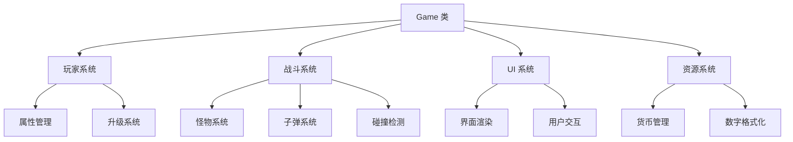

# 系统架构总览

## 整体架构

Pet Plan 采用单页面应用 (SPA) 架构，基于 HTML5 Canvas 技术构建。整个系统采用模块化设计，主要分为以下几个层次：

```
┌─────────────────────────────────────┐
│            UI 表现层                │
│  (HTML + CSS + Canvas 渲染)        │
├─────────────────────────────────────┤
│           游戏逻辑层                 │
│     (Game 类 + 各子系统)           │
├─────────────────────────────────────┤
│           数据管理层                 │
│    (玩家数据 + 游戏状态)            │
├─────────────────────────────────────┤
│           事件处理层                 │
│   (用户交互 + 游戏循环)            │
└─────────────────────────────────────┘
```

## 核心组件

### 1. Game 类 (游戏核心)
- **位置**: `js/game.js`
- **职责**: 游戏主控制器，协调各个子系统
- **主要功能**:
  - 游戏循环管理
  - 场景渲染
  - 事件处理
  - 系统协调

### 2. 玩家系统
- **位置**: `js/game.js` (player 对象)
- **职责**: 管理玩家角色数据和行为
- **主要功能**:
  - 角色属性管理
  - 移动和动画
  - 生命值管理
  - 升级系统

### 3. 战斗系统
- **位置**: `js/game.js` (combat 相关方法)
- **职责**: 处理战斗逻辑和效果
- **主要功能**:
  - 怪物生成和管理
  - 子弹系统
  - 碰撞检测
  - 伤害计算

### 4. UI 系统
- **位置**: `index.html` + CSS 文件
- **职责**: 用户界面展示和交互
- **主要功能**:
  - 游戏界面渲染
  - 用户交互处理
  - 状态显示
  - 弹窗管理

## 数据流

### 游戏状态数据流
```
用户操作 → 事件处理 → 游戏逻辑更新 → 数据状态变更 → UI 更新 → 渲染更新
```

### 具体流程示例 (升级系统)
```
1. 用户点击升级按钮
2. 触发 upgradeAttribute() 方法
3. 检查金币是否足够
4. 更新玩家属性数据
5. 更新升级成本
6. 刷新 UI 显示
7. 更新 Canvas 渲染
```

## 模块依赖关系



## 设计原则

### 1. 单一职责原则
每个模块只负责特定的功能，如：
- Game 类负责整体协调
- 玩家系统只管理玩家相关逻辑
- UI 系统只处理界面相关功能

### 2. 松耦合设计
模块间通过明确的接口进行通信，减少直接依赖

### 3. 数据驱动
游戏状态通过数据对象管理，UI 根据数据状态自动更新

### 4. 事件驱动
用户交互通过事件系统处理，支持多种输入方式

## 性能优化策略

### 1. 渲染优化
- 使用 requestAnimationFrame 进行流畅渲染
- 只重绘变化的区域
- 对象池管理子弹和爆炸效果

### 2. 内存管理
- 及时清理过期的游戏对象
- 复用 DOM 元素
- 避免内存泄漏

### 3. 计算优化
- 缓存计算结果
- 使用高效的碰撞检测算法
- 批量处理相似操作

## 扩展性设计

### 1. 模块化架构
新功能可以作为独立模块添加，不影响现有代码

### 2. 配置化设计
游戏参数通过配置对象管理，便于调整和扩展

### 3. 插件化支持
预留接口支持功能插件扩展

## 技术选型理由

### HTML5 Canvas
- **优势**: 高性能 2D 渲染，丰富的图形 API
- **适用场景**: 游戏画面渲染，动画效果

### 原生 JavaScript
- **优势**: 无依赖，性能好，兼容性强
- **适用场景**: 游戏逻辑实现，事件处理

### CSS3
- **优势**: 丰富的样式和动画效果
- **适用场景**: UI 界面，响应式设计

## 未来架构演进

### 短期目标
1. 模块化重构，将大文件拆分为小模块
2. 引入 TypeScript 提升代码质量
3. 添加单元测试

### 长期目标
1. 支持多人在线功能
2. 引入状态管理库
3. 支持 PWA 特性
