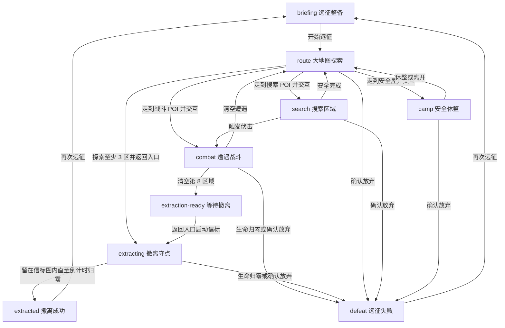

# 宠物远征：单局 RPG 搜打撤改造说明

## 1. 模式定位

战斗场景现已改造成“宠物远征”：一局独立的轻量 RPG 搜打撤模式。每局在 `3000×1900` 的俯视大地图中展开，玩家带领当前上阵宠物自由行进，实际走到搜索点、遭遇区和安全屋附近后交互，把战利品暂存在远征背包中，并在收益与风险之间决定继续深入或返回入口撤离。

本模式的核心不是清空固定波次，而是持续产生“再搜一个区域，还是现在收手”的判断：

- **搜**：追踪候选地点，用 WASD、方向键或屏幕方向键探索地图，靠近 POI 后选择搜索方式获取物资。
- **打**：战斗发生在世界坐标中，玩家可自由走位；主角和宠物自动攻击附近目标，玩家负责锁定目标、释放宠物主动技能和管理补给。
- **撤**：至少探索 3 个区域后解锁入口信标；必须返回地图西侧入口，并留在信标范围内守住倒计时，才能带回全部战利品。

命运桌、玩家成长、宠物编队、领地加成、资源系统与存档入口继续沿用。原“宠物防线”塔防模式已退出当前玩法，历史设计见 [宠物防线：竖版塔防改造说明](tower-defense-rework.md)。

## 2. 单局核心循环

1. 在远征终端点击“开始远征”，以满额远征生命、2 份补给和 8 格空背包开始一局。
2. `route` 阶段进入大地图自由探索；从两个候选地点中选择追踪目标，并实际行进到对应 POI。最深处只会出现核心守卫区。
3. 进入地点近距范围后按 `E` 或点击交互键，根据区域类型进行搜索、战斗或安全休整。
4. 战斗金币、水晶和经验先进入待结算收益；搜索和清场获得的物品进入远征背包。
5. 搜索与战斗清场会提高威胁，威胁越高，敌人与撤离守点越危险。
6. 探索满 3 个区域后，入口撤离信标解锁。玩家可以继续向地图东侧深入，也可以返程至西侧入口。
7. 在入口信标附近启动撤离后进入限时守点；倒计时只在主角位于信标范围内时推进，归零且主角仍存活时，全部收益正式入库。
8. 主角生命归零或主动放弃本局时撤离失败，背包物品全部遗失，只结算部分战斗收益。

离开战斗场景会暂停当前远征，并在本次页面会话中保留进度；返回战斗场景后继续。刷新页面或载入存档不会恢复局内远征状态。

## 3. 状态机



| 阶段 | 可执行操作 | 结束条件 |
| --- | --- | --- |
| `briefing` | 开始远征 | 创建路线，进入 `route` |
| `route` | WASD、方向键或屏幕方向键行进；追踪地点；近距交互；使用补给或放弃 | 在 POI 附近交互后，按节点类型进入搜索、战斗或安全屋 |
| `search` | 快速搜索、仔细搜刮、宠物侦察；使用补给或放弃 | 搜索完成回到路线，伏击则进入战斗 |
| `camp` | 安全休整、直接离开、使用补给或放弃 | 回到路线 |
| `combat` | 自由走位、自动攻击、点击锁敌、宠物技能、使用补给或放弃 | 清空敌人后回到大地图探索；生命归零则失败 |
| `extraction-ready` | 自由行进并返回地图西侧入口 | 在入口信标附近交互后进入撤离守点 |
| `extracting` | 信标范围内走位、战斗、宠物技能、使用补给 | 圈内倒计时结束则成功；离圈暂停；生命归零则失败 |
| `extracted` / `defeat` | 再次远征 | 重置局内状态 |

## 4. 大地图、路线节点与搜索

### 4.1 世界探索

- 单局世界固定为 `3000×1900` 逻辑单位，Canvas 尺寸仅代表当前视口；改变窗口或分辨率不会重排地点或改写玩家世界坐标。
- 玩家出生在地图西侧约 `(280, 950)`，入口撤离信标位于约 `(310, 950)`。路线深度沿地图由西向东展开，第 8 深度的核心守卫位于最东侧。
- 每个深度仍由 `ExpeditionRunSystem` 生成规则节点；`ExpeditionWorldSystem` 把两个候选节点映射为世界 POI。路线卡只负责切换追踪目标，不会瞬移或直接触发节点。
- 玩家接近可用 POI 后，按 `E` 或点击右下角交互键进入地点。同层未选择的另一分支会标记为错过；完成当前地点后，下一深度的 POI 才会加入世界。
- 世界包含遗迹、岩石和水域等矩形障碍。玩家与怪物按 X/Y 轴分别解析碰撞，可沿障碍边缘滑动；首版不包含导航网格或复杂寻路。
- 探索系统以 180 单位网格记录已揭示区域，默认揭示半径为 290。镜头平滑跟随并限制在世界边界内，画面叠加动态迷雾、追踪目标的屏外方向指示和小地图；小地图显示探索比例、地点、障碍、玩家与当前视口。
- 玩家可以在 `route`、`combat`、`extraction-ready` 和 `extracting` 阶段移动；在 `search` 与 `camp` 决策期间停止行进，避免离开地点后仍能远程结算。

控制方式：

| 操作 | 桌面 | 触屏 / 窄屏 |
| --- | --- | --- |
| 行进 | `WASD` 或方向键，可组合为八方向 | Canvas 下方屏幕方向键（D-pad），支持按住和组合方向 |
| 地点交互 | `E` | 交互按钮 |
| 追踪地点 | 点击右侧路线卡 | 点击右侧路线卡 |
| 优先锁敌 | 点击 Canvas 中的敌人 | 点击 Canvas 中的敌人 |

窗口失焦、页面隐藏、离开远征场景或控制器销毁时会清空移动输入，避免角色持续行走。

### 4.2 节点类型

一局默认共有 8 个探索深度。第 1～7 区域每次生成两个不同的候选节点，第 8 区域固定为核心守卫区。

| 节点 | 规则 |
| --- | --- |
| 废弃补给站 | 进入搜索阶段，基础风险较低。 |
| 密封仓库 | 进入搜索阶段；额外获得 1 件物品并提高品质，但伏击和威胁更高。 |
| 污染巡逻区 | 立即进入普通遭遇战。 |
| 精英巢穴 | 立即进入高强度遭遇战，清场后获得 2 件较高品质物品。 |
| 临时安全屋 | 可恢复生命、降低威胁并补充物资，也可以不休整直接离开。 |
| 核心守卫区 | 第 8 区域的固定首领战；清场后获得 3 件最高档次的战利品并进入最终撤离阶段。 |

### 4.3 三种搜索方式

| 搜索方式 | 物品数 | 威胁 | 伏击概率 | 发现补给概率 | 额外条件 |
| --- | ---: | ---: | ---: | ---: | --- |
| 快速搜索 | 1 | +5 | 8% | 12% | 无 |
| 仔细搜刮 | 2～3 | +14 | 30% | 28% | 物品品质提高 2 档判定权重 |
| 宠物侦察 | 2 | +8 | 14% | 22% | 至少上阵 1 只宠物 |

密封仓库会在上述结果上额外增加 1 件物品、3 点威胁、8 个百分点伏击概率和 8 个百分点补给概率，并进一步提高物品品质。每个搜索节点只能结算一次；发生伏击时，已找到的物资会先进入背包，清场后才继续路线。

安全屋休整会恢复远征最大生命的 34%、最多降低 18 点威胁，并增加 1 份补给。直接离开不会获得这些效果。

### 4.4 宠物探索天赋

每只宠物有一个只作用于指定搜索方式的探索天赋。最多 3 只上阵宠物可以同时生效，但聚合结果受统一上限约束：品质最多 `+2`，额外物品最多 `+1`，威胁最多 `-6`，补给发现率最多 `+25%`，伏击率最多 `-20%`。搜索反馈会明确显示实际生效的宠物和天赋。

| 宠物 | 搜索方式 | 天赋效果 |
| --- | --- | --- |
| 火焰犬 | 快速搜索 | 品质判定 +1 |
| 冰霜猫 | 宠物侦察 | 威胁 -3 |
| 雷电鸟 | 仔细搜刮 | 补给发现率 +12% |
| 大地熊 | 宠物侦察 | 伏击率 -8% |
| 风暴龙 | 仔细搜刮 | 额外发现 1 件战利品 |
| 光明独角兽 | 宠物侦察 | 补给发现率 +15% |
| 暗影狼 | 快速搜索 | 伏击率 -10% |
| 凤凰 | 仔细搜刮 | 品质判定 +1 |

## 5. RPG 战斗与宠物技能

### 5.1 遭遇战

- 玩家可以在遭遇战中继续自由行进并利用障碍走位；主角自动向 520 单位攻击范围内的最近敌人射击，并继续使用永久属性中的攻击、攻速、暴击、暴击伤害和多重射击。
- 领地攻击加成加入主角伤害；玩家防御与领地防御共同降低怪物伤害。
- 点击 Canvas 中的敌人可以设为优先目标。点击坐标会先经 `CameraSystem.screenToWorld()` 转为世界坐标；目标死亡或离开攻击范围后恢复自动锁敌。
- 怪物以当前 POI 或撤离信标为锚点，在约 260～430 单位外的可用世界位置生成，随后追踪主角并按各自攻击间隔造成伤害；怪物移动同样受世界边界和障碍碰撞约束。
- 怪物生命和攻击随探索深度、当前威胁及玩家等级提高；精英拥有额外倍率。
- 深度 3 起加入重甲骷髅，深度 5、精英战和撤离战可加入深渊恶魔，第 8 区域出现核心守卫。

远征生命是独立局内数值，不会改写玩家永久生命：

```text
远征最大生命 = max(80, 玩家最大生命 + 领地防御 × 3)
实际承伤 = max(1, 怪物攻击 -（玩家防御 + 领地防御）× 0.32)
```

每份补给恢复远征最大生命的 32%。补给可以在远征进行中的任意阶段使用，但生命已满时不会消耗。

### 5.2 宠物协同与主动技能

最多 3 只已上阵宠物作为伙伴参与战斗。宠物会在 430 单位索敌范围内自主接敌，并造成基于模板攻击与等级的伤害；每只宠物同时提供一个需要玩家点击释放的主动技能。技能只在遭遇战或撤离守点中可用，冷却下限为 3 秒。

| 宠物类型 | 主动技能定位 |
| --- | --- |
| 火 / 凤凰 | 对最多 4 个目标造成范围伤害，首要目标伤害更高。 |
| 冰 | 群体伤害，并把目标速度降至 48%，持续 3.2 秒。 |
| 地 | 群体伤害并眩晕 0.7 秒；同时获得 4.2 秒守护，使受到的伤害降低 42%。 |
| 雷 | 最多在 3 个目标间连锁，后续目标伤害逐次降低。 |
| 风 | 最多攻击 3 个目标，并附带短暂打断。 |
| 光 | 恢复远征生命，不要求场上存在攻击目标。 |
| 暗 | 优先打击一个目标；目标生命不高于 35% 时触发 1.8 倍斩杀伤害。 |
| 其他 | 对首要目标造成一次伙伴技能伤害。 |

怪物击杀奖励先记录在当前遭遇中；清场、撤离成功或中途失败时才提交到本局待结算收益。同一怪物与同一局的奖励都有幂等保护，避免重复发放。

## 6. 威胁与远征背包

### 6.1 威胁

威胁范围为 0～100，代表本局造成的动静与敌人警戒程度。

- 搜索增加 5～17 点威胁，具体取决于搜索方式和节点类型。
- 普通战斗清场增加 9 点，精英清场增加 14 点，首领清场增加 20 点。
- 启动撤离信标额外增加 5 点。
- 安全屋休整最多降低 18 点。

威胁会提高怪物生命、攻击、移动速度和攻击频率，也会增加撤离战的追兵数量、精英数量与守点时长。它不会在局外永久保存。

### 6.2 背包与待结算收益

收益分为两层：

- **战斗收益**：击杀获得的金币、水晶和经验，记录在本局待结算池。
- **背包战利品**：搜索和清场获得的普通、优秀、稀有、史诗物品；每件物品包含金币、水晶、经验和携带价值。

默认背包容量为 8 格。背包未满时直接收纳；背包已满时自动比较携带价值：更高价值物品替换当前最低价值物品，否则丢弃新物品。界面显示的是战斗金币加背包评分形成的“携带价值”，并不代表已经进入永久资源。

## 7. 撤离、失败与保底

### 7.1 主动撤离

探索至少 3 个区域后，地图西侧入口的撤离信标由锁定变为可用。玩家只能在 `route` 或 `extraction-ready` 阶段返回信标附近并交互启动撤离；不能从搜索、普通战斗、安全屋或地图其他位置远程撤离。

```text
撤离守点时长 = 8 秒 + floor(威胁 / 25) × 1.5 秒
追兵数量 = 4 + 已探索深度 + floor(威胁 / 14)
精英数量 = floor(威胁 / 35)
```

撤离战以入口信标为世界坐标生成追兵。主角处于信标中心约 146 单位范围内时倒计时推进；该范围与信标交互范围一致。离开范围后暂停且不重置，返回范围后继续。倒计时归零时立即视为撤离成功，不要求清空仍在场的追兵；主角必须保持存活。

### 7.2 结算规则

| 结果 | 金币 | 水晶 | 经验 | 背包物品 |
| --- | --- | --- | --- | --- |
| 撤离成功 | 全部战斗金币 + 背包金币 | 全部战斗水晶 + 背包水晶 | 全部战斗经验 + 背包经验 | 全部带回 |
| 战败 / 主动放弃 | 战斗金币的 30% | 0 | 战斗经验的 40% | 全部遗失 |

领地图书馆的经验百分比加成作用于最终结算经验。结算完成后金币、水晶和经验才会写入永久系统，并立即保存槽位 1。

每次结算还会提升本局上阵宠物的羁绊。成功撤离按深度计划获得 `2～12` 点，战败或放弃计划获得 `1～4` 点；羁绊上限为 100，界面按每只宠物的实际增长显示，满值时明确提示“羁绊已满”。命运桌训练不会增加羁绊。同一局的资源和羁绊共享 `settled` 幂等保护，不会因重复调用结算而重复增长。羁绊不直接放大战斗伤害，而是通过熟悉、默契、挚友三个档位增强宠物匹配的基地岗位活动。

“放弃本局”需要在 3.2 秒内点击两次确认，避免误操作清空背包；远征仍在进行时，“再次远征”不会绕过放弃流程。结算使用 `settled` 和 `lastSettlement` 保证同一局只发放一次。

## 8. 长期记录与存档边界

战斗存档只保存长期记录：

- `bestDepth`：历史最深探索区域。
- `extractions`：成功撤离次数。
- `losses`：战败与主动放弃次数。

以下内容属于单局状态，不进入存档：当前阶段、路线、节点、远征生命、补给、威胁、背包、怪物、投射物、技能冷却和撤离倒计时。加载存档后从远征整备阶段重新开始。

旧塔防记录会兼容迁移：`bestWave` 映射到 `bestDepth`，`victories` 映射到 `extractions`，`defeats` 映射到 `losses`。旧存档中的其他战斗字段会被安全忽略，宠物实例与上阵编队不改变。

## 9. 代码结构

### 新增

- `js/modules/expedition-run-system.js`
  - 管理路线生成、节点阶段、三种搜索、威胁、补给、背包和结算规则。
  - 支持注入随机函数，自动化测试可使用固定种子复现路线和掉落。
- `js/modules/expedition-world-system.js`
  - 管理 `3000×1900` 世界边界、路线 POI、入口撤离信标、固定障碍、轴分离碰撞、发现网格、探索比例、追踪目标和近距交互。
  - 不依赖 DOM 或 Canvas，路线类型与阶段仍由 `ExpeditionRunSystem` 决定。
- `js/modules/camera-system.js`
  - 管理独立于世界尺寸的 Canvas 视口、平滑跟随、边界约束及屏幕/世界坐标互转。
- `tests/extraction-rpg-smoke.mjs`
  - 覆盖纯规则状态流、搜索门槛、背包替换、撤离结算及战斗系统集成。
- `tests/world-exploration-smoke.mjs`
  - 覆盖镜头坐标往返与边界、视口 resize、世界边界与障碍滑动、斜向等速、POI 发现和近距交互、迷雾揭示、撤离圈暂停、宠物位置重置、入口自动追踪、非零镜头偏移锁敌，以及遭遇前后不传送玩家。
- `doc/design/extraction-rpg-rework.md`
  - 记录本次玩法、数值、存档与验证边界。

### 主要修改

- `js/modules/combat-system.js`
  - 作为 `extractionRpg` 模式的战斗协调器，连接规则、世界和镜头，管理移动输入、POI 交互、世界坐标遭遇、主角远征生命、主动技能、圈内撤离倒计时、奖励提交和分层 Canvas 渲染。
- `js/controllers/battle-scene-controller.js`
  - 绑定 WASD、方向键、屏幕方向键、`E` 交互、路线追踪、搜索、安全屋、补给、宠物技能、撤离和放弃操作，并按统一战斗状态刷新远征终端。
- `js/modules/player-system.js`
  - 在远征模式中把移动更新委托给 `CombatSystem.updateHeroMovement()`，使用局内生命显示，不再自动追敌行进，也不写回永久生命。
- `js/modules/game-core.js`
  - 通过 `setViewportSize()` 解耦 Canvas 与世界尺寸，并把远征整帧渲染委托给 `CombatSystem.renderExplorationFrame()`。
- `js/main.js`
  - 继续负责系统组装、场景暂停恢复、状态回调和结算保存。
- `index.html`、`css/style.css`
  - 将防线指挥面板替换为远征终端，增加路线、背包、威胁、事件提示和技能栏。
- `tests/browser-smoke.html`
  - 验证世界宽度与视口解耦、键盘移动、路线追踪不会直接触发事件、靠近 POI 后交互，以及搜索结算后的 HUD 同步。

### 关联复用

- `js/modules/pet-system.js`
  - `extractionRpg` 模式复用已有伙伴巡航、接敌和近战动画；宠物养成与编队数据保持不变。

`js/modules/wave-system.js` 与塔防专项文档保留为历史参考，不再参与当前远征战斗流程。

## 10. 测试与验收

统一自动化回归命令：

```powershell
npm test
```

`tests/extraction-rpg-smoke.mjs` 主要覆盖：

1. `ExpeditionRunSystem` 的路线、搜索、战斗节点与撤离解锁状态流。
2. 宠物侦察门槛、威胁增长、背包容量及高价值自动替换。
3. 撤离成功结算和重复结算幂等。
4. `CombatSystem` 的遭遇生成、宠物技能伤害与冷却、主角承伤。
5. 成功与失败时资源、经验只发放一次。

`tests/world-exploration-smoke.mjs` 主要覆盖：

1. `CameraSystem` 的屏幕/世界坐标往返、四向边界和视口 resize。
2. 世界边界、矩形障碍碰撞、沿墙滑动和斜向等速。
3. POI 追踪、发现、近距交互、同层分支失效和重复交互保护。
4. 未探索区域不会提前暴露地形，主动追踪后才显示远端目标情报。
5. 撤离只能在入口近距启动，交互范围与有效撤离圈一致，离圈后倒计时暂停。
6. 新一局会重置宠物世界位置，最终阶段会自动追踪入口信标。
7. 非零镜头偏移下的 Canvas 锁敌坐标，以及遭遇开始和结束不传送玩家。

Node 冒烟覆盖世界与镜头的逻辑边界，但不验证 Canvas 像素、小地图和迷雾的实际视觉结果，也不会模拟真实用户连续走完整张地图。浏览器冒烟补充覆盖世界/视口解耦、短距离键盘移动、目标追踪和近距交互；为控制时长，它会把测试角色直接放到首个 POI 附近，不会自动完成整图返程。

浏览器冒烟页继续验证战斗导航、远征开始、路线操作、DOM 状态同步和场景历史；手工验收入口为：

```text
http://127.0.0.1:8080/?scene=dungeon
```

手工验收重点：

- 三种搜索方式只在搜索节点出现，宠物侦察正确校验编队。
- WASD、方向键和屏幕方向键移动方向正确；斜向输入不会比单轴移动更快，窗口失焦或离开场景后不会继续行进。
- 镜头平滑跟随且不会越过地图边界；改变分辨率不会改变玩家世界坐标。
- 路线卡只改变追踪目标，必须靠近 POI 后才能交互；障碍能够阻挡玩家，探索比例、小地图、迷雾和屏外方向提示随位置更新。
- 路线、生命、威胁、背包、补给与敌人数随行为同步刷新。
- 点击敌人能锁定目标，宠物技能触发效果并进入冷却。
- 探索 3 个区域前不能撤离；解锁后必须返回西侧入口，离开信标圈会暂停倒计时，返回后继续。
- 撤离成功、战败和主动放弃均只结算一次，刷新后不会恢复局内背包。
